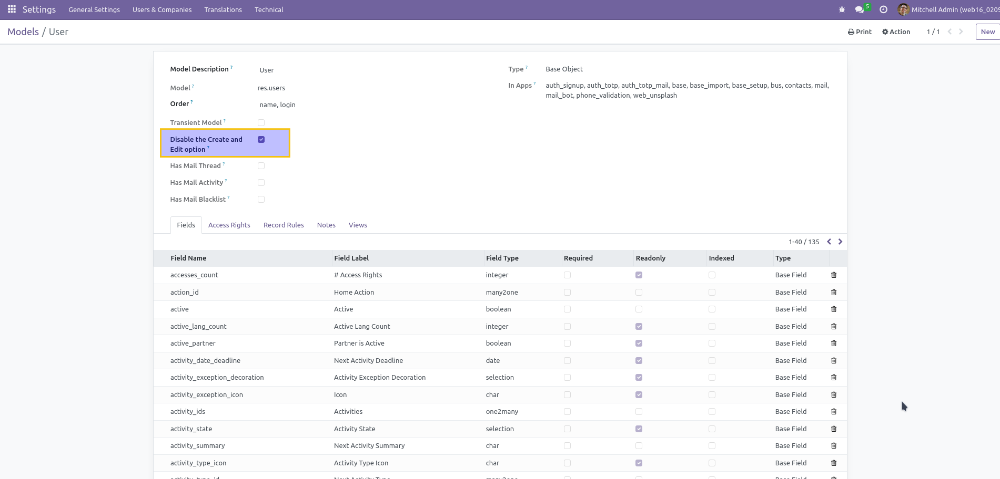
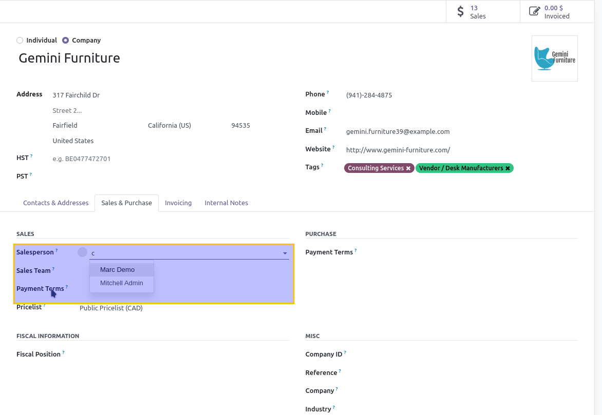

====================
Disable Quick Create
====================

This module disables the « Quick Create » option on relational fields all over the application. It also allows to disable the « Create and Edit » option on a per model basis.

Disable the « Create and Edit » option
--------------------------------------
In order to disable the « Create and Edit » for a specific model :

* Go to « Settings → Technical → Database Structure → Models

* Select your model

* Check the box « Disable Create and Edit »

Contributors
------------
* Numigi (tm) and all its contributors (https://bit.ly/numigiens)

More informations
----------------
* Meet us at https://bit.ly/numigi-com