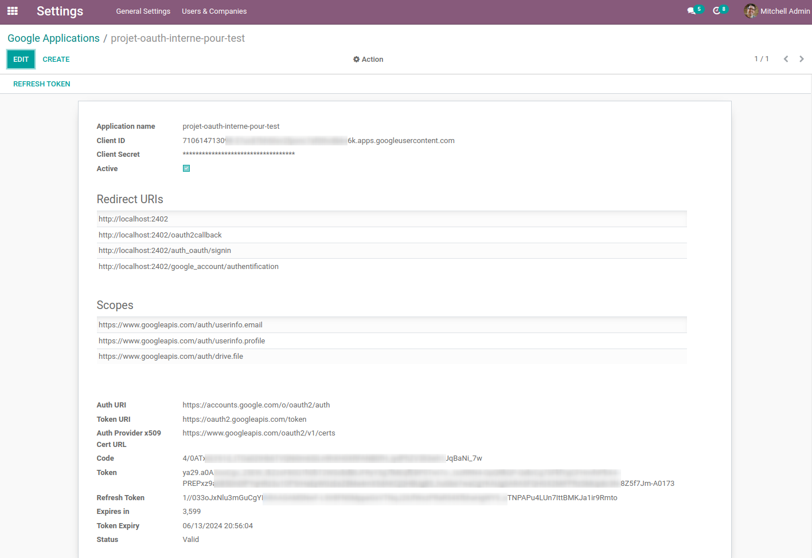

Google API Authentication
=========================
This module allows to connect to Google API.

Usage
-----
In `Settings > Technical > Google API > Google Applications`, you can set non read-only fields to configure your Google API connection.

Notice that you can only activate one Google Application at a time.

For the first time, you need to click on the `Refresh Token` button to get the refresh token. This will open a new tab in your browser to authenticate with Google. Once you have granted the access, you will be redirected to the Odoo homepage.

Check the following fields if they are correctly filled after the authentication:
* `Code`
* `Token`
* `Refresh Token`
* `Expires in`
* `Token Expiry`
* `Status`
* `Flow State`

Contributors
------------
* Numigi (tm) and all its contributors (https://bit.ly/numigiens)
