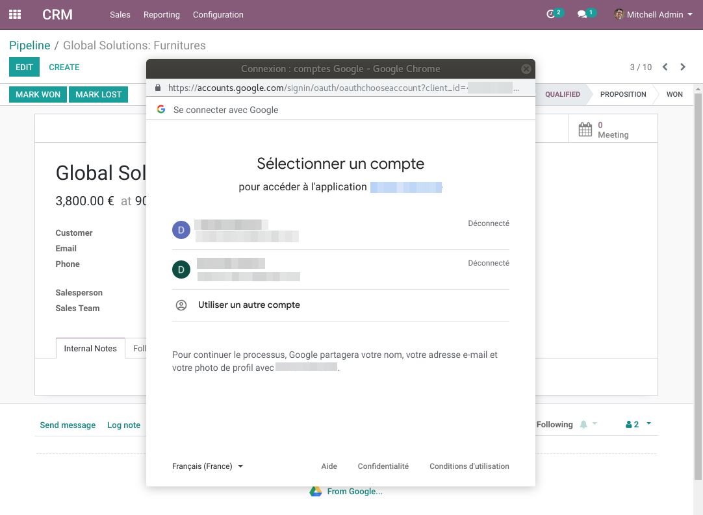
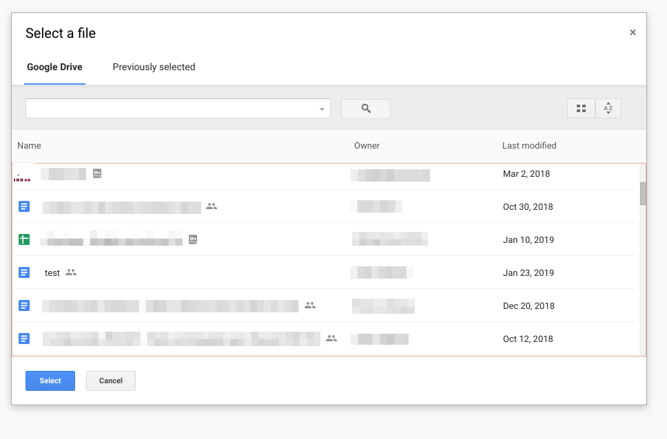

Google Attachement
==================
This module allows to attach documents from Google Drive.

The attached documents are not stored in Odoo. Only the url and the document name are stored in Odoo.
This allows permissions to access the attached documents to be managed in Google Drive.

Usage
-----

Go to any form view and click on the attachment icon.

Click on the `From Google...` button.

Authenticate to Google (only needed the first time).

Select your attachments.

Your document is now attached to Odoo.

If you click on the attachment, your google document will open in a new browser tab.

Configuration
-------------
1. Go to the [Google Developper Console](https://console.developers.google.com/apis/dashboard).
2. Setup a project with Google (if you do not have one already).
3. Create an OAuth2 Client ID.
4. Create an API Key.
5. Activate the access to the [Google Picker API](https://developers.google.com/picker/).
6. In Odoo, go to `Settings / General Settings`.
7. In the section `Attachments From Google Drive`, fill your OAuth Client ID and your API Key.

Contributors
------------
* Numigi (tm) and all its contributors (https://bit.ly/numigiens)

More information
----------------
* Meet us at https://bit.ly/numigi-com
