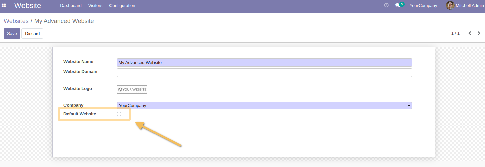
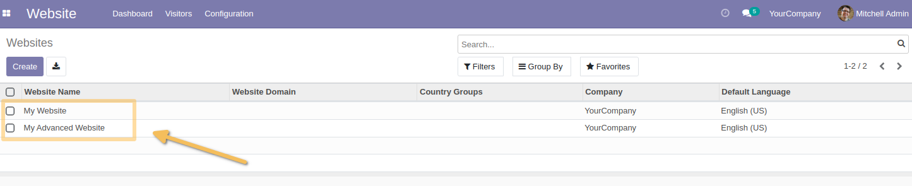
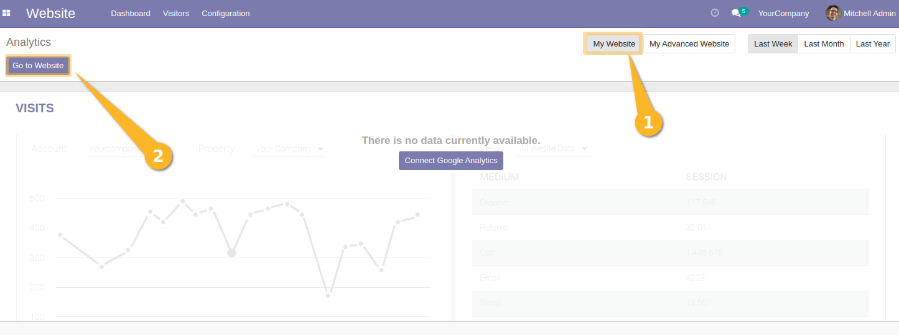
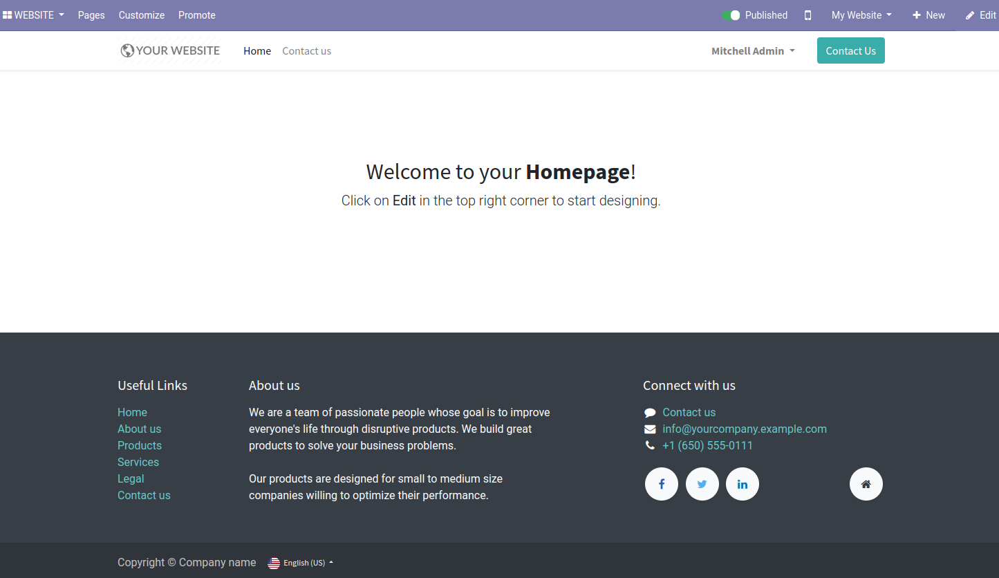
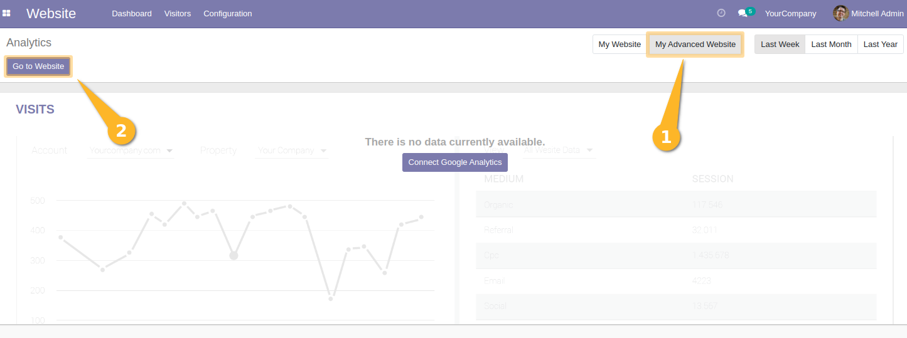
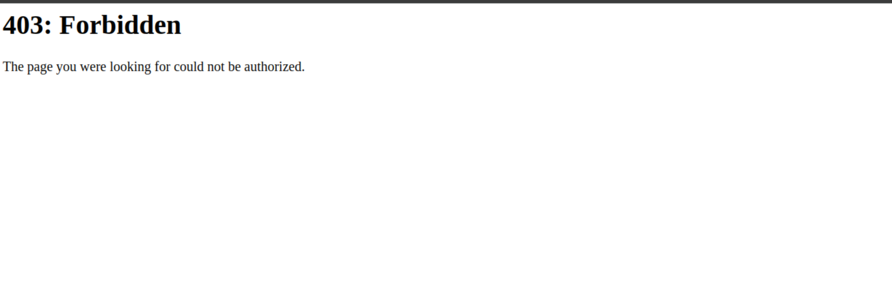
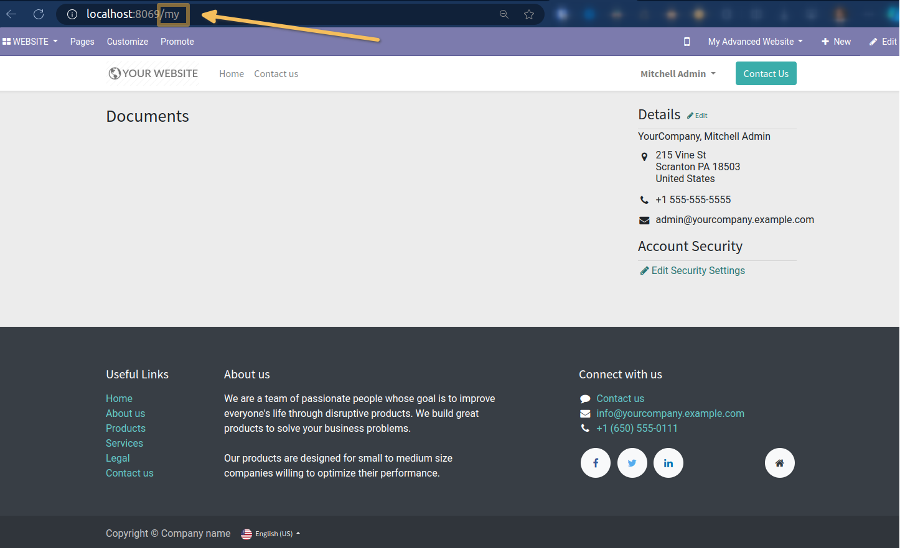
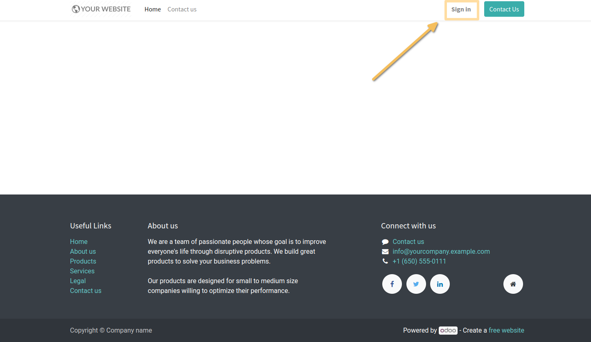

Multi Website User Access
=========================
This module allows to restrict user access to specific websites.

Usage
-----
After installation, this module will make as default the main website and add it to all users as allowed website.

As a `Website / Editor and Designer` user, I go to the `Website > Configuration > Websites`.
I select one of the websites to switch to form view.
I see that a new `Default Website` check box is present.

On create a new user, the default website will be added to the allowed websites of this user.

- All internal users have by default access to all existing websites.
- All portal users have by default access to the main website.

Use Case
--------
I have added new website : `My Advanced Website` and I want to restrict access to this website to only some users.

Mitchell Admin is a user with access to `My Website`, already set as default website on all user. 
So he can access only `My Website`.

When I go to `My Website`, I can see that I have access to this website.

When I go to `My Advanced Website`, I can see that I have no access to this website.

**NOTICE**
----------
1. User portal page is not affected by this module. User can still access to its portal page.

2. User can still access to the main default website if he is not logged in.

3. All pages that linked to a specific website will be checked (e.g. event, shop, ...).

Contributors
------------
* Numigi (tm) and all its contributors (https://bit.ly/numigiens)
