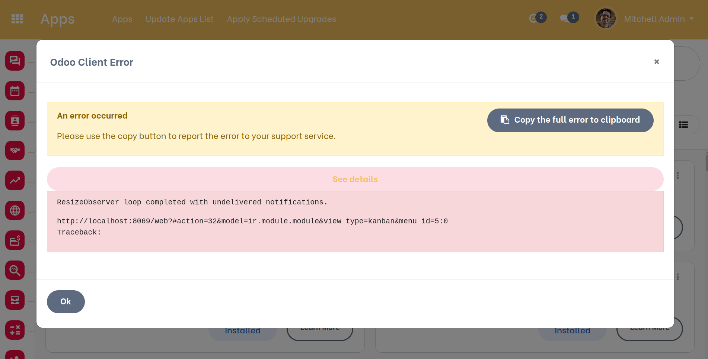

Resize Observer Error Catcher
=============================

This module prevent the raising of an error when resizing the window (by zoom in or zoom out).
Here are the errors that the module skipped :
- `ResizeObserver loop completed with undelivered notifications`
- `ResizeObserver loop limit exceeded`

Contributors
------------

The `Numigi <https://numigi.com/r/home>`_ team is the contributor to this project. We help Quebec companies implement Odoo and Konvergo ERP.
