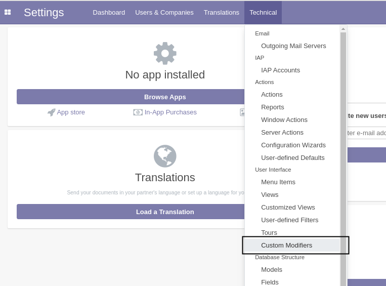
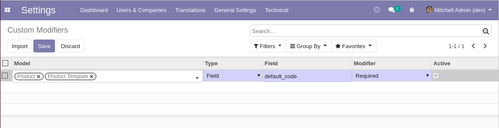
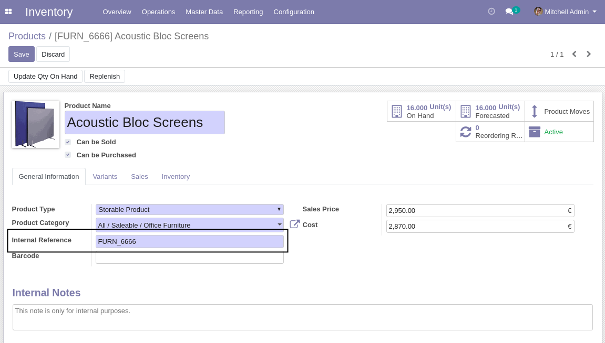
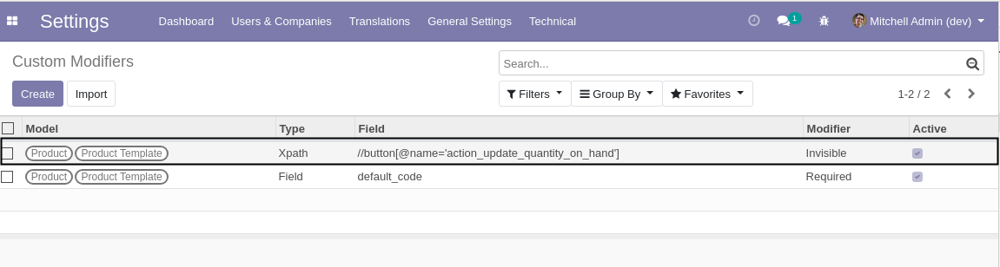
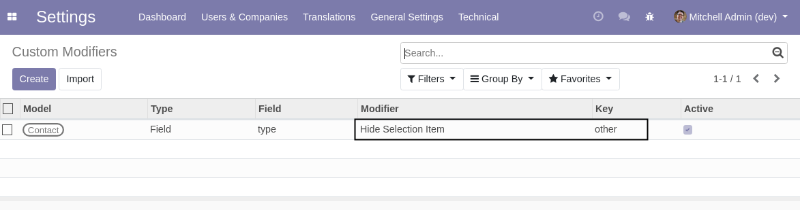
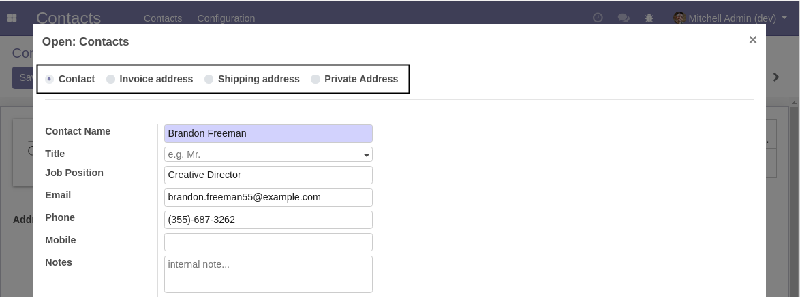
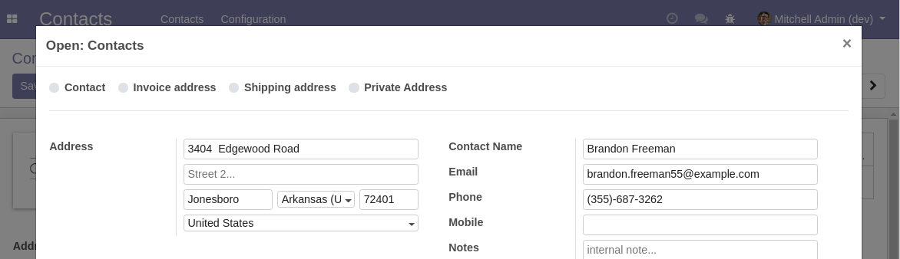

Web Custom Modifier
===================
This module allows to customize modifiers on form view nodes.

For example, it allows to make a field readonly, invisible or required.

Usage
-----
As system administrator, I go to `Settings / Technical / User Interface / Custom Modifiers`.

I create a new custom modifier.

The modifier is configured to make the field ``default_code`` of a product required.

After refreshing my screen, I go to the form view of a product.

I notice that the field ``default_code`` is required.

Advanced Usage
--------------
In the field ``Type``, I can select ``Xpath``.
This allows to set a modifier for a specific view node, such as a button.

The example above hides the a button in the form view of a product.

Hide Selection Item
-------------------
Since version ``1.1.0``, the module allows to hide an item (option) of a selection field.

The above example hides the type of address ``Other``.

Beware that if the hidden option is already selected on a record,
it will look as it was never set.

Therefore, this feature should only be used to hide options that are never used.

Contributors
------------
* Numigi (tm) and all its contributors (https://bit.ly/numigiens)
