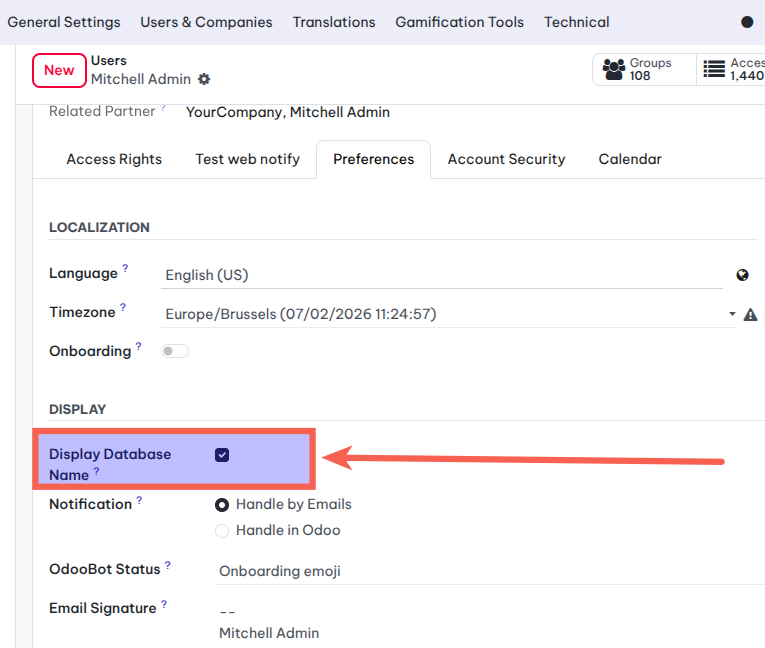
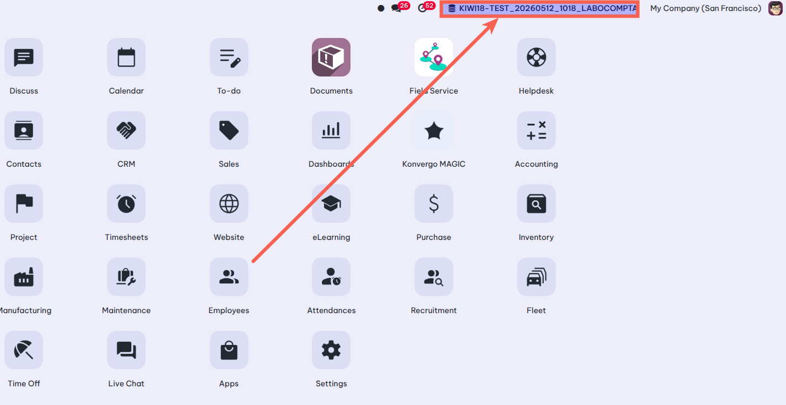

================================
Web Db Name Display
================================

.. contents:: Table of Contents

Summary 
-------

This module displays the database name directly in the Odoo navbar without activating the developer mode.

Context
--------

In Odoo standard, the database name is hidden from users unless developer mode is activated.

Configuration
------------

A new button has been added to the user form view to display the database name.

Usage
-----------

The database name will now be displayed.

Bug Tracker
-----------
Bugs are tracked on the repository issues tracker. In case of trouble, please
check there if your issue has already been reported.

Contributors
------------
* Numigi (tm) and all its contributors (https://bit.ly/numigiens)