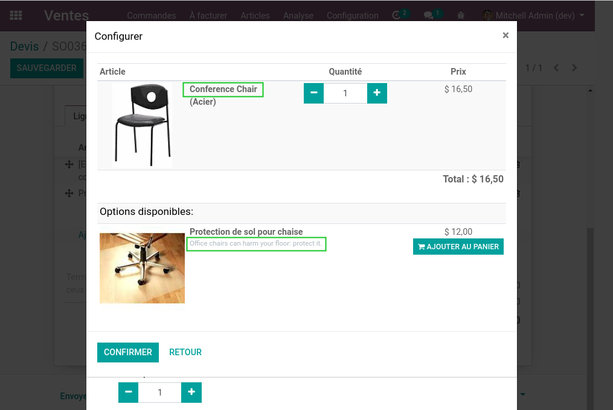
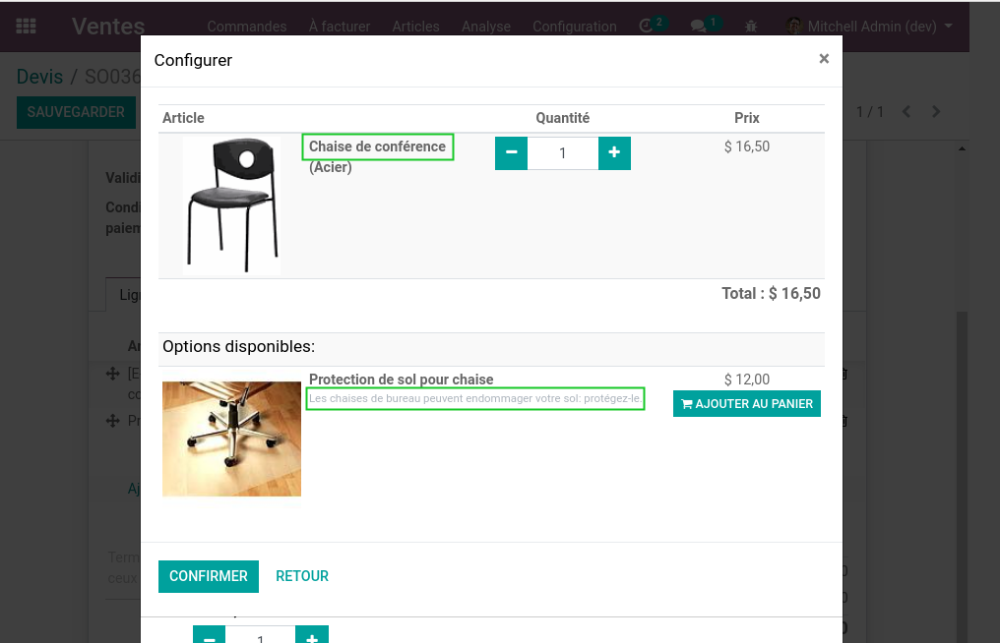

Web Editor Backend Context
==========================

Context
-------
In vanilla Odoo 14.0, the product configurator is wrongly translated.

This is because it uses utilities from the module web_editor.
This later module was developped mainly for frontend purposes,
but it is also used by the backend.

The problem is that the wizard uses the language of the navigator instead of the user language.

Usage
-----
After installing this module, backend widgets using the web_editor features are correctly translated.

Contributors
------------
* Numigi (tm) and all its contributors (https://bit.ly/numigiens)

More information
----------------
* Meet us at https://bit.ly/numigi-com
