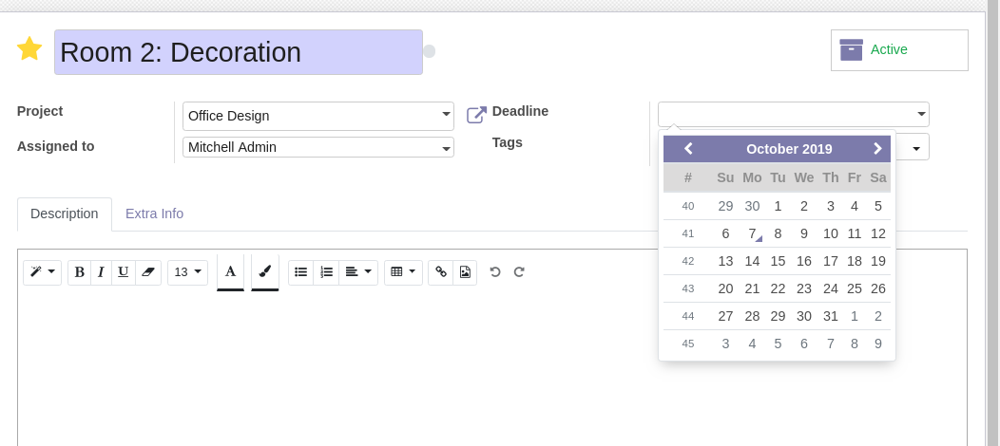

Web Form Disable Autocomplete
=============================
This module disables auto-complete on basic input fields.

Before
------
Before installing the module, incoherent input suggestions hide the calendar widget.

.. image:: web_form_disable_autocomplete/static/description/before.png

The above picture shows the issue with date pickers.

Depending on the OS, the navigator and the browsing history, you may experience issues with
other basic input fields (such as the name of the ticket).

In some cases, the fields of a form view are auto-filled like an address.
This, even if the form view is in edit mode (the record already exists).

After
-----
After installing the module, autocomplete on basic input fields is disabled.

Contributors
------------
* Numigi (tm) and all its contributors (https://bit.ly/numigiens)

More information
----------------
* Meet us at https://bit.ly/numigi-com
