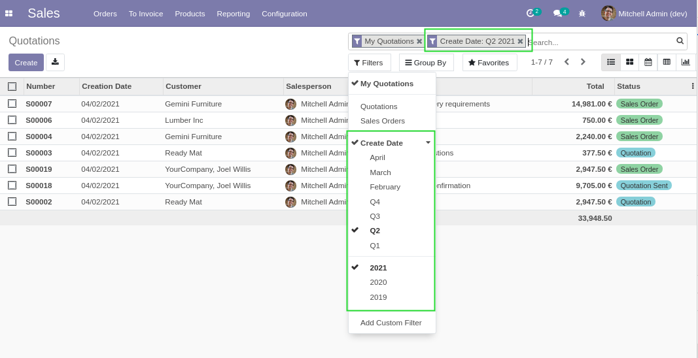
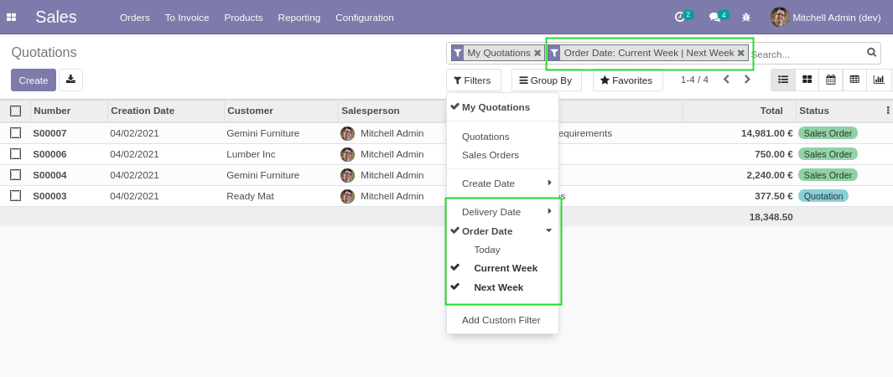
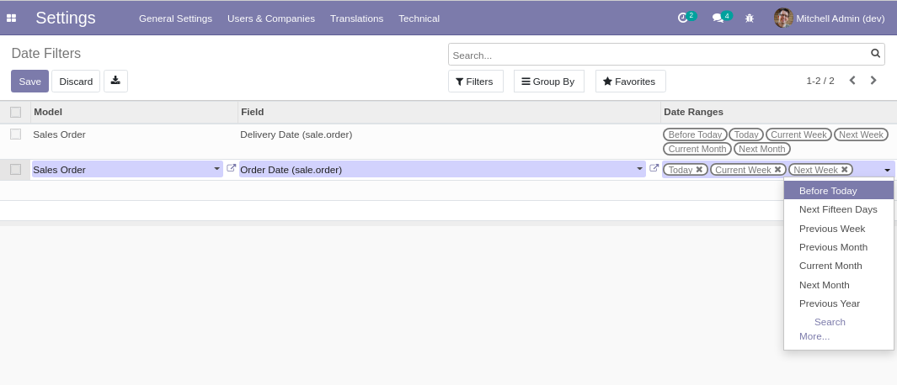
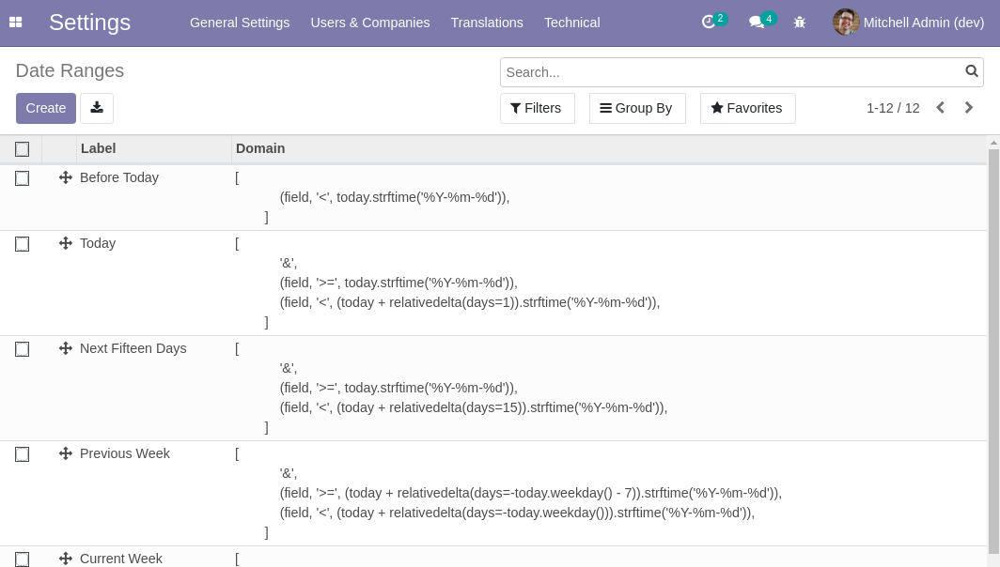
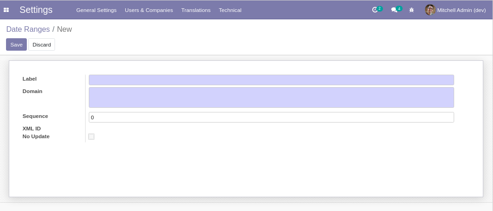
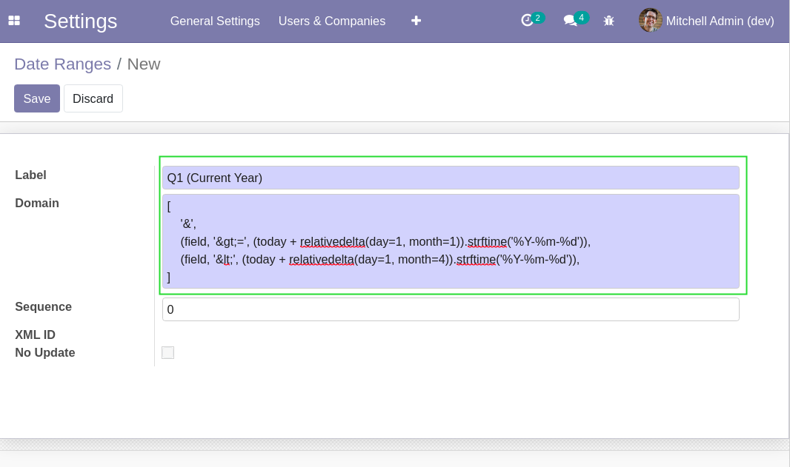
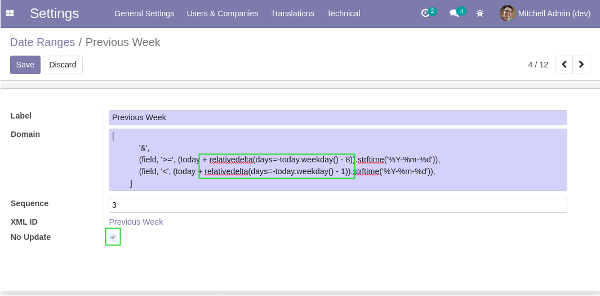

Web Search Date Range
=====================

.. contents:: Table of Contents

Context
-------
Vanilla Odoo comes with a predefined set of date range filters.

There are multiple issues with these filters:

* They can not be customized (at least without extra javascript code).
* They are based on static dates, which is not suitable for dashboards (you don't want to update your dashboard every month).
* Quarters are only relevant for a company with a fiscal exercise from January to December.

Overview
--------
This module allows to easily add contextual date range filters.

Contextual means that the filter does not need to be updated.
It always filters records based on the current date.

You may add one of these filters to your favorites or your dashboard and it will not need to be refreshed.

Configuration
-------------

Date Filters
************
To edit the list of filters that appear in the search view of a model:

* Go to: Settings / Technical / User Interface / Date Filters

After editing the filters, you need to refresh your page for the changes to be applied.

Date Ranges
***********
The module comes with the following predefined date ranges:

* Before Today
* Today
* Next Fifteen Days
* Previous Week
* Current Week
* Next Week
* Previous Month
* Current Month
* Next Month
* Previous Year
* Current Year
* Next Year

To add a custom range type:

* Go to: Settings / Technical / User Interface / Date Ranges

* Click on `Create`.

* Enter a label for your range type.
* Enter a domain filter for your new range type.

The following variables can be used inside the domain:

* field: the technical name of the field being queried
* today: the current date in the timezone of the user
* datetime: the datetime.datetime class
* relativedelta: the dateutil.relativedelta.relativedelta class
* MO, TU, WE, TH, FR, SA, SU: dateutil.relativedelta.weekdays

See the library `relativedelta <https://dateutil.readthedocs.io/en/stable/relativedelta.html>`_ for more info.

Weekly Date Ranges
------------------
Weekly date ranges are implemented from monday to sunday.

If you prefer from sunday to saturday:

* Go to: Settings / Technical / User Interface / Date Range Types.
* For each weekly range type:
	1. Adapt the domain.
	2. Check the `No Update` checkbox.

Contributors
------------
* Numigi (tm) and all its contributors (https://bit.ly/numigiens)
