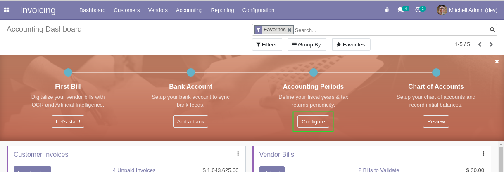
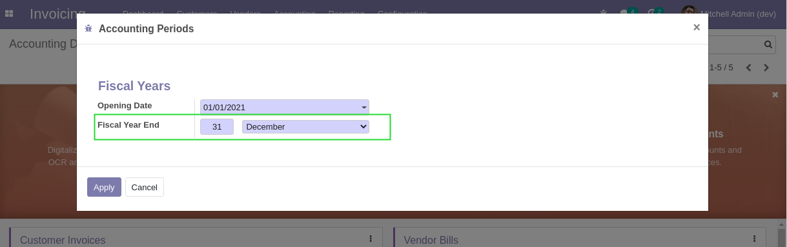
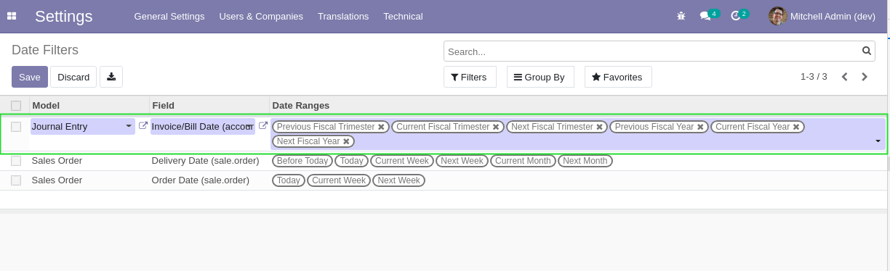
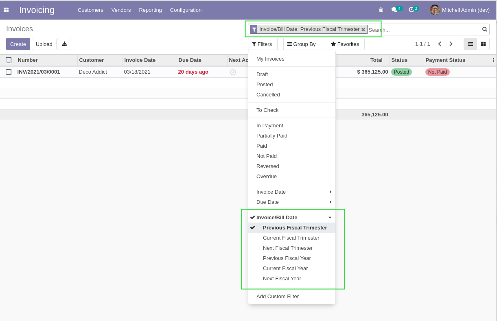

Web Search Date Range Account
=============================
This module extends the web_search_date_range module with date ranges related to accounting.

It enables date filters that are bound to the fiscal year of the company.

.. contents:: Table of Contents

Configuration
-------------
The module uses the Fiscal Year settings to determine the fiscal year and trimester ranges.

Usage
-----
To add a filter to the search view of a model:

* Go to: Settings / Technical / User Interface / Date Filters

* Refresh your page, then go to the list view of the model (i.e. Journal Items)

Available Ranges
----------------
For now, the following filters are available.

* Previous Trimester
* Current Trimester
* Next Trimester
* Previous Fiscal Year
* Current Fiscal Year
* Next Fiscal Year

Multi-Company
-------------
The module works with multi-company.

If you have subsidiaries with different account closing dates, the same filters will work for all.
You will not need to recreate your dashboards for each subsidiary.

Contributors
------------
* Numigi (tm) and all its contributors (https://bit.ly/numigiens)
