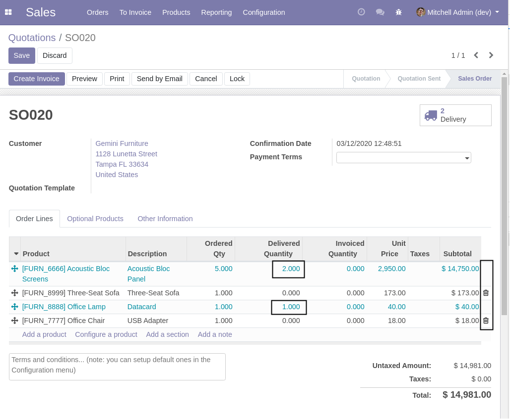

Web Trash Condition
===================
This module adds the possibility to make the trash widget invisible under a given condition.

Usage
-----
By itself, this module does not modify the behavior of Odoo.

To use the feature for a given model, you must define a boolean field ``trash_widget_invisible`` on it.
Typically, it is a computed field.

Here is an example with a sale order line.

.. code-block:: python

    from odoo import api, fields, models

    class SaleOrderLine(models.Model):

        _inherit = 'sale.order.line'

        trash_widget_invisible = fields.Boolean(compute="_compute_trash_widget_invisible")

        @api.depends('qty_delivered')
        def _compute_trash_widget_invisible(self):
            for line in self:
                line.trash_widget_invisible = bool(line.qty_delivered)

In this example, the widget is invisible if the product was delivered (fully or partially).

In the list view, you must add the field ``trash_widget_invisible``, otherwise, it will not be used.

.. code-block:: xml

    <record id="sale_order_form" model="ir.ui.view">
        <field name="name">sale.order.form</field>
        <field name="model">sale.order</field>
        <field name="inherit_id" ref="sale.view_order_form"/>
        <field name="arch" type="xml">
            <xpath expr="//field[@name='order_line']/tree" position="inside">
                <field name="trash_widget_invisible" invisible="1"/>
            </xpath>
        </field>
    </record>

Here is the result:

Contributors
------------
* Numigi (tm) and all its contributors (https://bit.ly/numigiens)

More information
----------------
* Meet us at https://bit.ly/numigi-com
