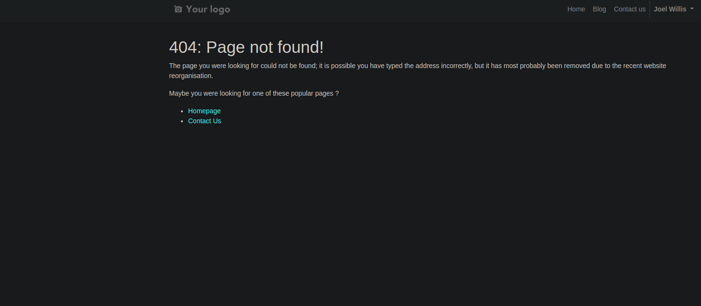

Website Blog Restricted Access
==============================
This module restricts access to blogs and their items to internal users only.

Usage
-----
When accessing the blog as an internal user, access is granted.

When accessing the blog as an external user, access is denied.

The access will also be denied to an external user if they try to access blog items through a URL.

Usage
-----
No configuration is required after installation.

Contributors
------------
* Numigi (tm) and all its contributors (https://bit.ly/numigiens)

More information
----------------
* Meet us at https://bit.ly/numigi-com
