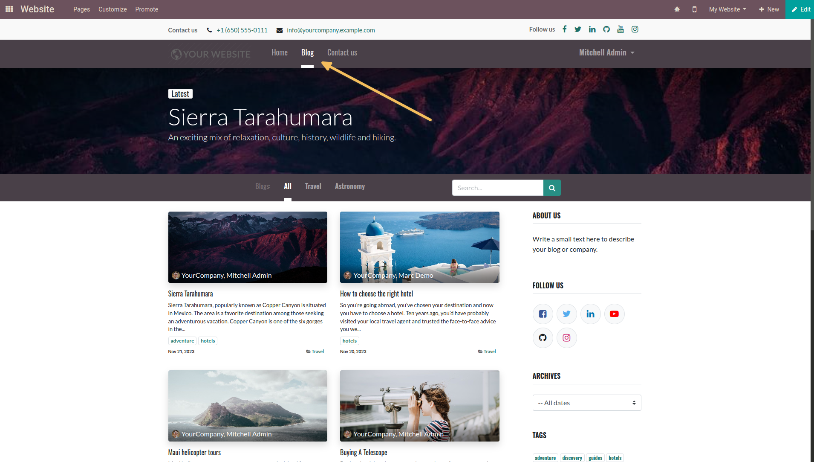
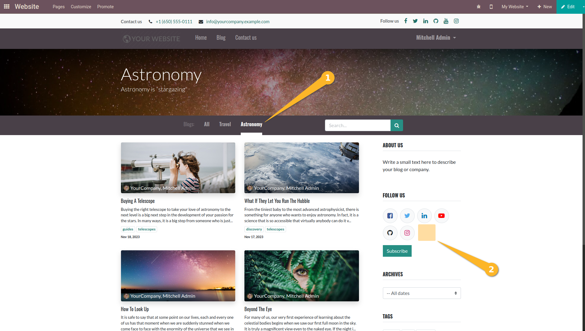

Website Blog RSS Feed Disabled
==============================
This module removes the RSS Feed sharing icon on blog pages.

Usage
-----
As a logged in user or not, I access a blog page.

After choosing a blog page, I notice that the RSS Feed sharing icon is no longer present.

Contributors
------------
* Numigi (tm) and all its contributors (https://bit.ly/numigiens)
