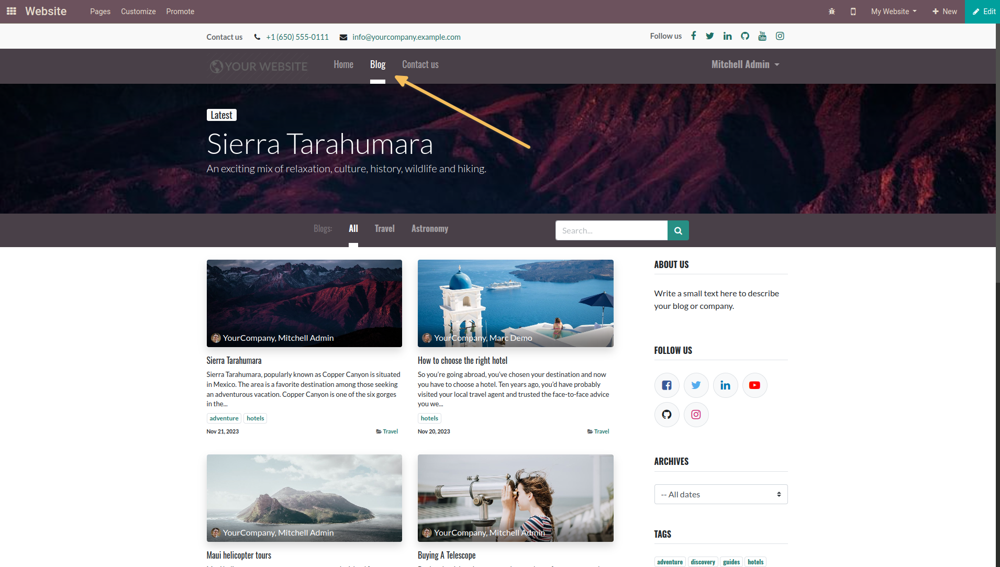
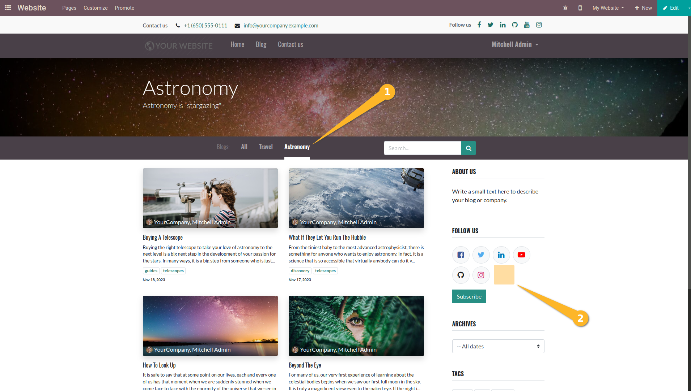

Website Blog RSS Feed Disabled
==============================
This module removes the RSS Feed sharing icon on blog pages.

Usage
-----
As a logged in user or not, I access a blog page.

After choosing a blog page, I notice that the RSS Feed sharing icon is no longer present.

Contributors
------------

The `Numigi <https://numigi.com/r/home>`_ team is the contributor to this project. We help Quebec companies implement Odoo and Konvergo ERP.