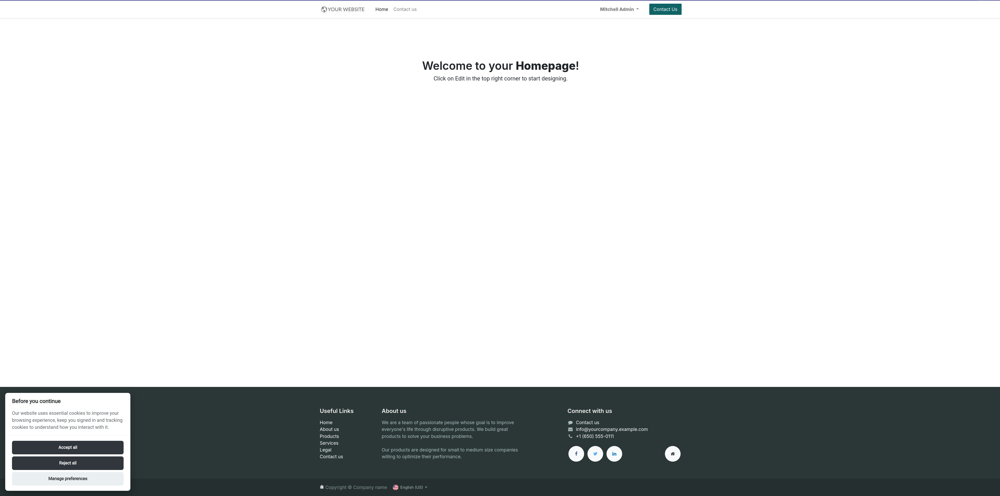
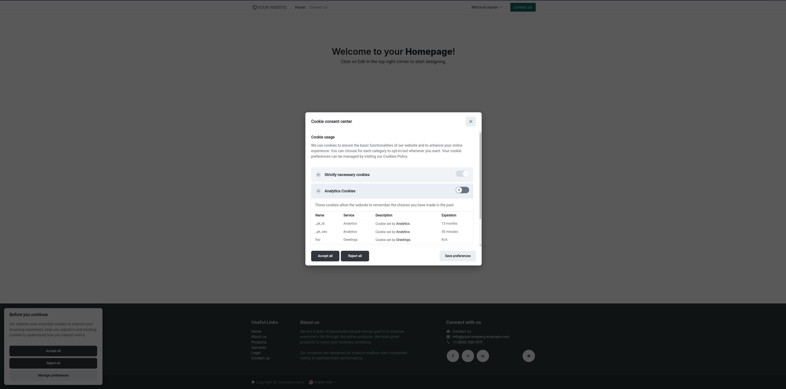

===================
Website CookieConsent
===================

This module integrates Odoo website with [Orestbida's CookieConsent plugin](https://github.com/orestbida/cookieconsent).

**Table of contents**

.. contents::
   :local:

Configuration
=============

To configure this module, you need to:

# . Go to **Website > Configuration > Settings**
# . Search 'CookieConsent' option.
# . Toggle 'Use CookieConsent'.
# . Click on "Save" button.

Notes
=====

The files inside '/static/src/js', '/static/src/css' and '/static/src/i18n' are the default configuration, stylesheets
and locales used by CookieConsent.

The [upstream maintainer](https://github.com/orestbida/cookieconsent) offers a [playground](https://playground.cookieconsent.orestbida.com/)
to test the extent of the customization.

Credits
=======

Authors

~~~~~~~

* Numigi
