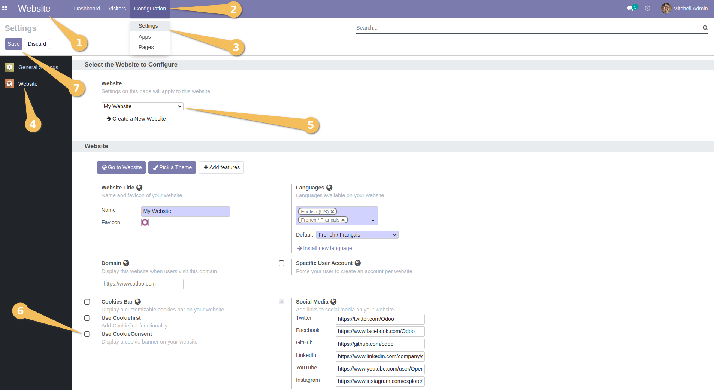
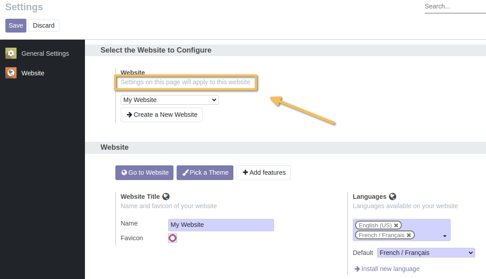

=====================
Website CookieConsent
=====================

This module integrates Odoo website with [Orestbida's CookieConsent plugin](https://github.com/orestbida/cookieconsent).

**Table of contents**

.. contents::
   :local:

Configuration
=============

To configure this module, you need to:

# . Go to **Website > Configuration > Settings**
# . On the `Website` settings tab, then select the website to configure
# . Scroll down to the `CookieConsent` section.
# . Toggle `Use CookieConsent`.
# . Click on `Save` button.

IMPORTANT: The `CookieConsent` section will only be applied to the website selected in the `Website` settings tab.
As it already has been mentioned that `Settings on this page will apply to this website`.
So if you want to apply the same settings to another website, you need to repeat the same steps for that website.

After that, when you visit the website, you will see a banner at the bottom of the page asking for your consent to use cookies.

.. image:: static/description/cookieconsent.png

When you click on the `Manage preferences` button, you will see a pop up window with containing strictly necessary cookies and analytics cookies.

.. image:: static/description/cookieconsent_modal.png

Notes
=====

The files inside `/static/src/js`, `/static/src/css` and `/static/src/i18n` are the default configuration, stylesheets
and locales used by CookieConsent.

The [upstream maintainer](https://github.com/orestbida/cookieconsent) offers a [playground](https://playground.cookieconsent.orestbida.com/)
to test the extent of the customization.

Contributors
============

* Numigi (tm) and all its contributors (https://bit.ly/numigiens)

More information
================
* Meet us at https://bit.ly/numigi-com
