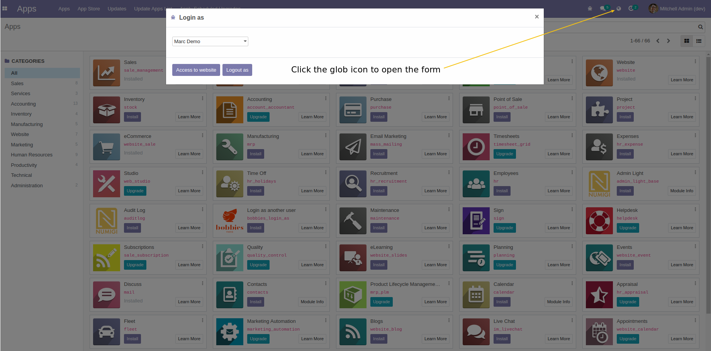
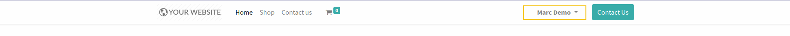

================================
Login as another user in website
================================

This module allows to login as another user in website.

For example, this option could be useful to check what's displayed for your customers.

Usage
=====

**Web Login**

**Web Logged in**

Contributors
------------
* Numigi (tm) and all its contributors (https://bit.ly/numigiens)

More information
----------------
* Meet us at https://bit.ly/numigi-com

