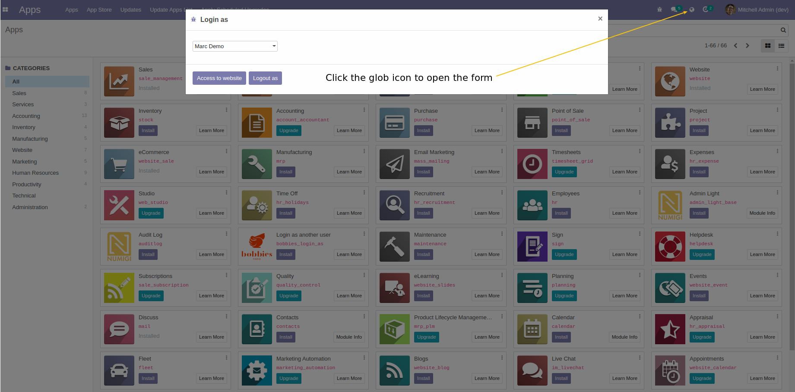
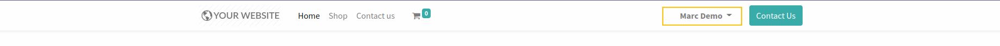

================================
Login as another user in website
================================

This module allows to login as another user in website.

For example, this option could be useful to check what's displayed for your customers.

Usage
=====

**Web Login**

**Web Logged in**

Contributors
------------

The `Numigi <https://numigi.com/r/home>`_ team is the contributor to this project. We help Quebec companies implement Odoo and Konvergo ERP.

