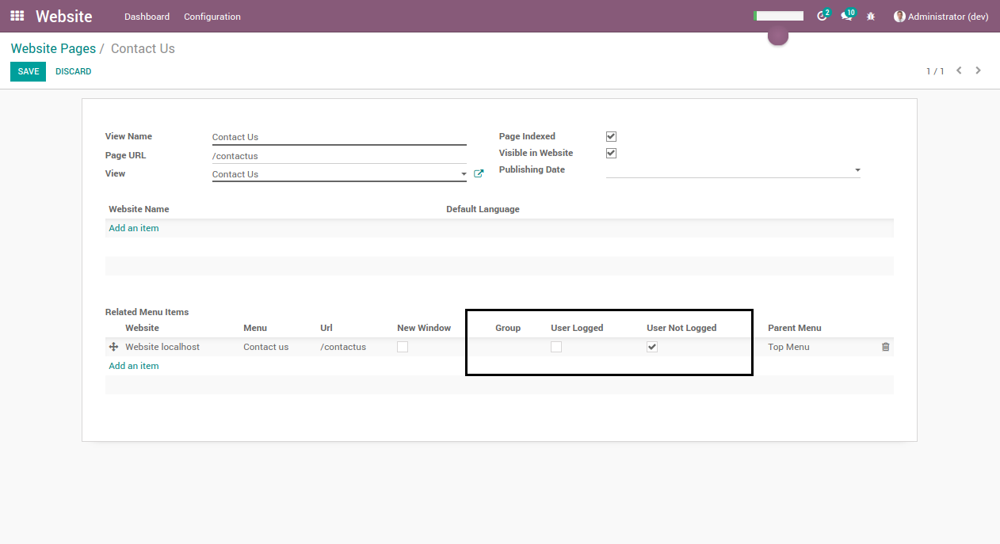

===========================
Website Menu By User Status
===========================

The module manages display website menu entries, depending if the user is logged or not.
The selection of the display status can be chosen logged and/or not.

The module also allows to display the menu item only for specific groups of users.

Usage
=====

To use this module, you need to:

#. Go to Website > Configuration > Settings > Pages.
#. Select the page for which you would like to hide the menu.
#. In the `Related Menu Items` table, check whether the menu item is visible for logged/unlogged users.
#. Optionaly, select a group for which to display the menu item.

Contributors
------------
* Numigi (tm) and all its contributors (https://bit.ly/numigiens)
* Meyomesse Gilles <meyomesse.gilles@gmail.com>
