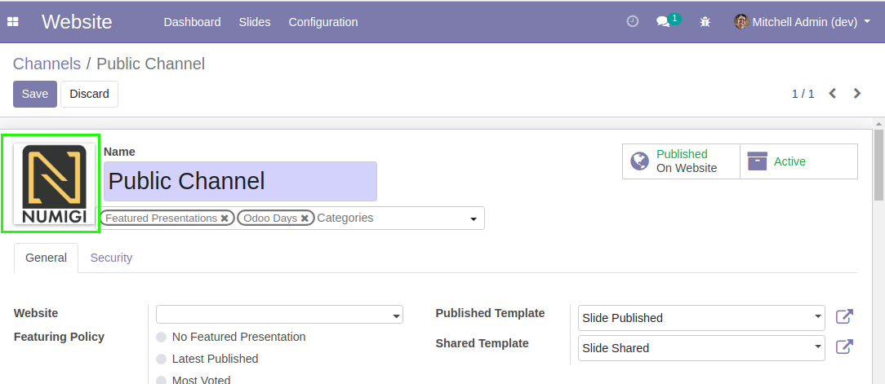

Website Slide Logo
==================

.. contents:: Table of Contents

Context
-------
By default, in the website view of a slide, the Odoo logo is displayed.

Description
-----------
After adding this module, a field is added on slide channels to select a logo.

On the website view of slides, the logo is displayed instead of the Odoo logo.

Contributors
------------
* Numigi (tm) and all its contributors (https://bit.ly/numigiens)

More information
----------------
* Meet us at https://bit.ly/numigi-com
